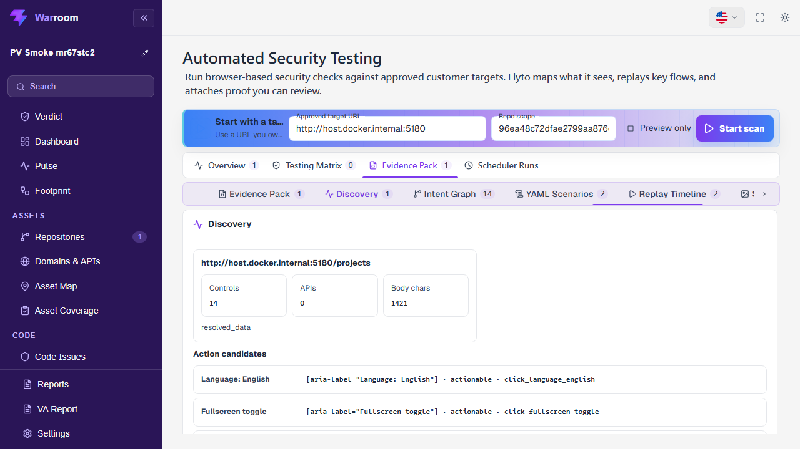
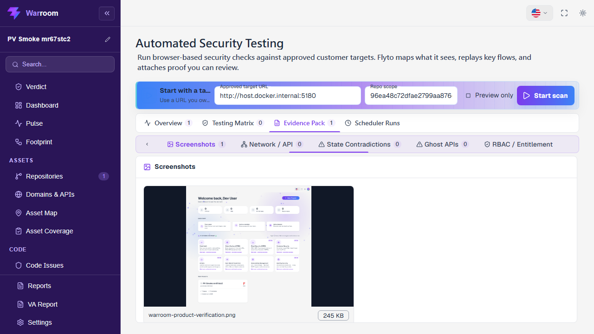
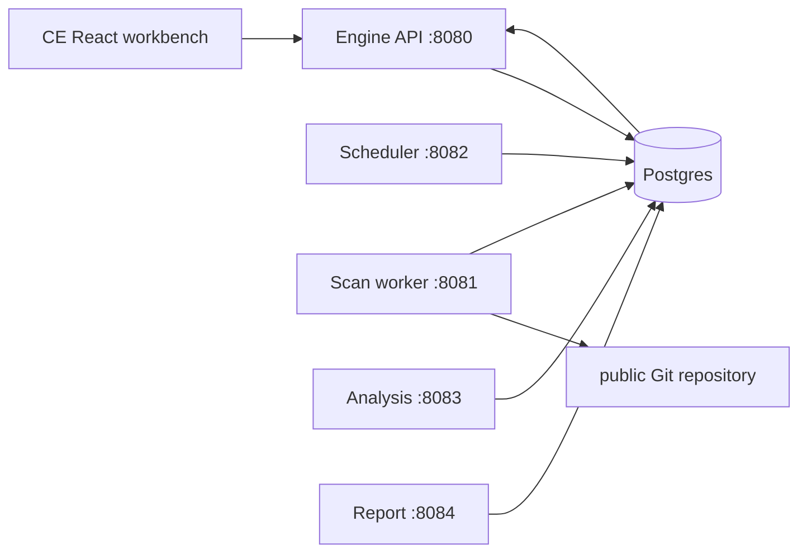

# Flyto2 Warroom

[](https://hub.docker.com/r/flyto2/warroom)
[](https://github.com/flytohub/flyto-warroom)
[](https://flyto2.com)
[](https://docs.flyto2.com/warroom/self-hosted-ce)
[](LICENSES.md)

Self-hosted Community Edition for the Flyto2 security operations platform.

Flyto2 Warroom CE is a self-hosted source-available security workbench.
Connect a public Git repository, run credential-free source checks, review
evidence and transparent risk-chain hypotheses, verify remediation, and
export a local HTML report.

It is not a scanner-only dashboard. Existing security tools are
inputs; the product loop is:

```text
Repository -> Scan -> Findings -> Evidence -> Risk Hypotheses -> Verify -> Report
```

## See The Warroom In Action

These first-party English captures come from the canonical Flyto2
Warroom product-verification interface. They are real product screens,
not authentication pages, a hosted landing page, or a design mockup.

### Automated Security Discovery



### Evidence Pack Review



CE is useful without Flyto2 Cloud. Enterprise Cloud Bridge adds
commercial intelligence, managed remediation, identity, support,
fleet execution, and signed premium evidence when teams need it.

Flyto2 Warroom CE is the self-hosted source-available code-security loop:
local users, public repositories, queued scans, findings, evidence,
non-authoritative risk hypotheses, remediation verification, and reports.

It is built for teams that want a local Warroom they can install, inspect,
patch, verify, and connect back to Flyto2 Enterprise services when they
need commercial intelligence, managed remediation, or enterprise controls.

Enterprise and SaaS editions are assembled as build-time overlays on a
pinned Flyto2 Warroom CE commit. The running system never pulls source
code dynamically; license tier, overlays, image digests, and verification
evidence are recorded during packaging.

This is a generated source-available layout: CE is the public noncommercial base,
and paid editions are overlays built from a pinned CE commit. Public
changes are imported back into the private source workspace, tested,
and re-exported so the CE tree does not become a disconnected fork.

## Official Channels

| Channel | Link | Purpose |
| --- | --- | --- |
| Product page | https://flyto2.com | CE positioning and edition model |
| Docs | https://docs.flyto2.com/warroom/self-hosted-ce | Install, local auth, Docker tags, and Enterprise bridge boundaries |
| GitHub | https://github.com/flytohub/flyto-warroom | Public source mirror, contracts, governance, and contribution loop |
| Docker Hub | https://hub.docker.com/r/flyto2/warroom | Published CE service images |

## What Is Flyto2 Warroom?

Flyto2 Warroom brings security signals into one cockpit instead of leaving
them as disconnected scanner output. A finding should map to an asset, a
score, evidence, ownership, remediation, verification, and an audit trail.

The CE distribution is intentionally usable, but it is not a full source
release of the private Flyto2 backend. Enterprise-only datasets, live
remediation orchestration, hosted control planes, and commercial approval
workflows stay behind explicit capability gates.

## Core Capabilities

| Area | What CE is meant to show | Enterprise path |
| --- | --- | --- |
| Local identity | One-time administrator setup and engine-issued local JWT | Enterprise identity and policy controls |
| Repository security | Credential-free public Git scans for secrets, IaC, source, and dependency signals | Managed connectors and proprietary intelligence |
| Evidence | Deterministic evidence digests and finding-linked records | Signed premium evidence and commercial correlation |
| Risk chains | Explainable, non-authoritative attack-path hypotheses | Authoritative scoring and cross-organization calibration |
| Remediation | Guidance and finding-fingerprint re-verification | Approval, execution, rollback, and managed remediation |
| Reporting | Local portable HTML reports | Enterprise reporting, retention, and support |
| Operator experience | 16 languages and light/dark/system themes | Enterprise branding and fleet governance |

The machine-generated edition matrix lives in `docs/feature-matrix.md`
and is derived from the engine module catalog instead of hand-written
marketing copy.

## Installation

```sh
git clone https://github.com/flytohub/flyto-warroom.git
cd flyto-warroom
python3 install/scripts/setup-ce.py
make preflight
make verify-images
make ce-up
```

Open `http://localhost:8088` and create the first administrator in the
one-time browser setup. Later visits use the normal sign-in page.

Default local ports:

| Service | Port |
| --- | --- |
| Warroom UI | `8088` |
| Engine API | `8080` |
| Scan worker | `8081` |
| Scheduler | `8082` |
| Analysis | `8083` |
| Report | `8084` |
| Postgres | `5432` |

## Usage

Use `make ce-up`, `make ce-ps`, and `make ce-logs` for the normal local
operator loop. The browser cockpit at `http://localhost:8088` owns project
setup, findings, attack paths, evidence, remediation, and verification.
See `docs/README.md` for task-oriented guides and `docs/reference/README.md`
for exact source-level functions, methods, and classes.

## API Reference

The authoritative public HTTP contract is
`packages/flyto-contracts/openapi/flyto-engine.openapi.yaml`. Generated SDK
stubs and conformance fixtures live beside it in `packages/flyto-contracts/`.
Implementation links are generated under `docs/reference/`.

## Configuration

Run `python3 install/scripts/setup-ce.py` to create `install/.env`. Start
from `install/.env.ce.example`; every variable includes its purpose and
safe local default. Enterprise simulation uses
`install/.env.ee-sim.example`. Never commit generated `.env` files.

### Build The Public Source Profile

The source profile builds the complete PolyForm Noncommercial 1.0.0 CE
PostgreSQL, all five Go runtimes, and the independent React CE frontend
directly
from this repository. It does not pull
Flyto2 service images or require credentials:

```sh
make setup-ce
make source-build
make source-up
make source-smoke
```

Open `http://127.0.0.1:18088/sign-in`; a fresh database redirects to the
one-time local administrator form.
This source profile owns authenticated projects, durable public-repository
scans, findings, health summaries, and local report delivery. See
`docs/source-build.md`.

## Architecture



The public repository is generated from allowlisted packages and contracts.
The complete local CE product path under `services/flyto-engine-ce` is
source-published: local auth, PostgreSQL projects, durable scans, native
findings, and reports. Commercial datasets, billing, customer connector
credentials, SaaS/Enterprise adapters, and live remediation remain private.

## Components

| Package | Source | Files | Role |
| --- | --- | ---: | --- |
| `flyto-code` | `flyto-code` | 41 | Independent React/Vite CE workbench with built-in languages and themes. |
| `flyto-contracts` | `flyto-engine` | 28 | Public OpenAPI, capabilities, schemas, examples, and SDK stubs. |
| `flyto-engine-ce` | `flyto-engine` | 168 | Five independently buildable Go CE runtimes and their public kernel. |

## Docker Images

Published repository: `docker.io/flyto2/warroom`

| Service | Tag |
| --- | --- |
| Engine API | `engine-ce` |
| Scan Worker | `worker-ce` |
| Scheduler | `scheduler-ce` |
| Analysis | `analysis-ce` |
| Report | `report-ce` |
| Warroom UI | `code-ce` |

Stable release `v0.5.1` builds per-service `*-0.5.1`
Docker images directly from that tagged public source after its `main`
commit passes CI. See `docs/official-builds.md` for the release contract.

## CE And Enterprise

CE is designed to be useful without calling Flyto2 Cloud. Higher-value
Enterprise capabilities can be attached through the Enterprise Cloud
Bridge: CE keeps the local database, UI, evidence timeline, and audit trail;
Flyto2 Cloud provides entitled premium services such as commercial threat
intelligence, managed runner fleets, live remediation orchestration,
enterprise identity, and commercial AI proposal workflows.

Premium actions must fail closed when a license, entitlement, permission,
connector, signature, or cloud service check fails. See
`docs/enterprise-cloud-bridge.md`.

CE scores are local and externally observed. They are useful for self-hosted
verification, but they are not public, cross-organization rating authority
scores. Public rating authority, Firebase-backed authority services, and
calibration remain private signed overlays.

| Edition | Best for | Notes |
| --- | --- | --- |
| CE | Personal research, education, public-interest organizations, and noncommercial self-hosting | Source-available packages, public contracts, local install, runnable CE images |
| Enterprise Cloud Bridge | Teams that need premium intelligence or managed execution | Entitled cloud jobs return signed evidence to the local Warroom |
| Enterprise Airgap | Regulated deployments that cannot call Flyto2 Cloud | Private images, signed offline licenses, support, and controlled update bundles |

## Local Operations

| Task | Command |
| --- | --- |
| Start CE | `make ce-up` |
| Stop CE | `make ce-down` |
| Follow logs | `make ce-logs` |
| Reset local database | `make ce-reset-db` |
| Build public source profile | `make source-build` |
| Start public source profile | `make source-up` |
| Smoke public source profile | `make source-smoke` |
| Stop public source profile | `make source-down` |
| Verify release tree | `make verify` |
| Verify image digests | `make verify-images` |

See `docs/local-install.md` for setup and reset details. See
`docs/enterprise-simulation.md` for local enterprise-gate simulation.

## What Stays Private

The following areas are intentionally not published as CE source:
- billing, entitlement mutation, commercial gates, and Stripe/offline-license adapters
- enterprise SSO/SAML/SCIM, legal hold, airgap installers, deployment edition internals
- darkweb, stealer-log, proprietary phishing-feed credentials/data, commercial threat-intel, and proprietary correlation datasets
- cloud/container/runtime live remediation orchestration and customer connector credentials
- Flyto2 Cloud Enterprise Bridge services, entitlement signer, managed job execution plane, and hosted SaaS control plane
- AutoFix promotion, approval, rollback orchestration, and commercial AI proposal workflows
- hosted SaaS-only frontend configuration, private preview credentials, and enterprise image publishing metadata

## Contributing

This repository is a generated CE mirror, not a permanent fork. Public PRs
are reviewed here, converted into upstream patch bundles, applied to the
source repos, tested, and re-exported. Accepted CE changes should improve
Flyto2 itself, not only this mirror.

Run before opening release-sensitive PRs:

```sh
python3 install/scripts/audit-release-tree.py .
python3 scripts/audit-ce-boundary.py .
python3 scripts/audit-provenance.py .
python3 scripts/audit-open-core-overlay.py .
```

## Verification

The generated tree includes fail-closed release checks:

- `make verify` runs release audits and Docker image digest dry-run.
- `make audit` runs release, CE boundary, provenance, open-core overlay, and GitHub protection audits.
- `make verify-images` checks the public Docker image coordinates and
  expected digests in `OPEN_CORE_MANIFEST.json`.
- GitHub Actions run governance, release, frontend build, contract, and
  Docker image audit jobs.
- `OPEN_CORE_MANIFEST.json` records credential-free source commits, the
  deterministic file inventory/tree hash, packages, image digests, release
  files, closed-source boundaries, and merge contracts.

## Testing

Run `make test` for the CE Go source, frontend boundaries, and public
contract fixtures. Run `make verify` for the complete release gate. After
installing `flyto-indexer`, `make docs` refreshes the source reference and
`make docs-check` detects documentation drift.

## Security

Report vulnerabilities privately. Do not submit credentials, customer
data, private image coordinates, production tokens, private keys, or
enterprise-only implementation details. See `SECURITY.md` and
`docs/code-protection.md`.

## License

Flyto2-owned CE source, installer, workflow, and generated documentation
in this release use PolyForm Noncommercial 1.0.0. Commercial production,
paid hosting/SaaS, resale/OEM, and paid client delivery require a separate
written commercial license. Third-party packages keep their own licenses.
Historical `v0.1.0` and `v0.1.1` releases remain Apache-2.0; those already
granted rights are not revoked. See `LICENSES.md` for the full FAQ and
package boundaries.
