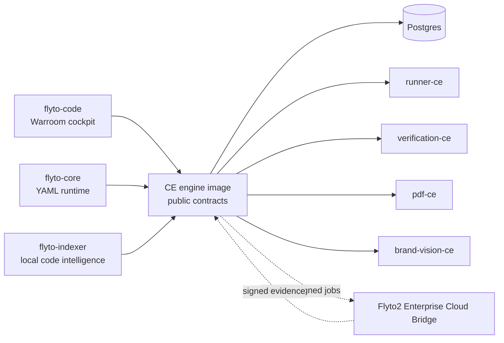

# Flyto2 Warroom

[](https://hub.docker.com/r/chesterhsu/flyto-warroom)
[](https://github.com/flytohub/flyto-warroom)
[](https://flyto2.com)
[](https://docs.flyto2.com/warroom/self-hosted-ce)
[](LICENSES.md)

Self-hosted open-core security war room for the Flyto2 security operations
platform.

Flyto2 Warroom CE is the self-hosted open-core security operations
platform for code, CTEM, external attack surface, cloud, container,
runtime, automated security testing, evidence, scoring, and compliance
workflows.

It is built for teams that want a local Warroom they can install, inspect,
patch, verify, and connect back to Flyto2 Enterprise services when they
need commercial intelligence, managed remediation, or enterprise controls.

## Official Channels

| Channel | Link | Purpose |
| --- | --- | --- |
| Product page | https://flyto2.com/open-source/ | CE positioning and edition model |
| Aikido alternative | https://flyto2.com/aikido-alternative/ | Careful comparison for teams evaluating Aikido-style platforms |
| Docs | https://docs.flyto2.com/warroom/self-hosted-ce | Install, local auth, Docker tags, and Enterprise bridge boundaries |
| GitHub | https://github.com/flytohub/flyto-warroom | Public source mirror, contracts, governance, and contribution loop |
| Docker Hub | https://hub.docker.com/r/chesterhsu/flyto-warroom | Published CE service images |

## 10-Minute Local Loop

```sh
git clone https://github.com/flytohub/flyto-warroom.git
cd flyto-warroom
python3 install/scripts/setup-ce.py --email admin@example.com
make preflight
make verify-images
make ce-up
python3 install/scripts/seed-demo-workspace.py --email admin@example.com
```

Open `http://localhost:8088`, sign in with the local admin account, and select
the `Flyto2 Warroom CE Demo` workspace. The seeded evidence pack walks through
code, container, cloud, external attack surface, evidence, and AutoFix.

The seed is honest: it does not claim live cloud/container/runtime remediation
unless an Enterprise Bridge or supported connector is configured.

## What Is Flyto2 Warroom?

Flyto2 Warroom brings security signals into one cockpit instead of leaving
them as disconnected scanner output. A finding should map to an asset, a
score, evidence, ownership, remediation, verification, and an audit trail.

The CE distribution is intentionally usable, but it is not a full source
release of the private Flyto2 backend. Enterprise-only datasets, live
remediation orchestration, hosted control planes, and commercial approval
workflows stay behind explicit capability gates.

## Core Capabilities

| Area | What CE is meant to show | Enterprise path |
| --- | --- | --- |
| Code security | SAST, SCA, secrets, IaC, reachability, code score, evidence | AI proposals, promotion, approval, rollback |
| CTEM and external exposure | Footprint, asset map, posture, issue lifecycle, scoring | Commercial enrichment and continuous monitoring |
| Automated security testing | Authorized DAST/runner workflows, replay, evidence | Managed runner fleet and scale-out execution |
| Cloud, container, runtime, VM | Posture views, connector contracts, local evidence | Live remediation and managed connector execution |
| Threat intelligence | Public/feed-backed lookups where configured | Darkweb, stealer, leak, phishing, actor, malware datasets |
| Evidence and compliance | Audit timeline, reports, evidence packs, verification | Legal hold, offline license, airgap, enterprise support |
| Identity and governance | Local roles, capabilities, gated actions | SSO/SAML/SCIM, advanced entitlement, commercial billing |
| AI governance | Deterministic fallback, audit events, provider visibility | Quota, routing, commercial AI proposal workflows |

## Quick Start

```sh
git clone https://github.com/flytohub/flyto-warroom.git
cd flyto-warroom
python3 install/scripts/setup-ce.py --email admin@example.com
make preflight
make verify-images
make ce-up
```

Open `http://localhost:8088` and sign in with the local admin account
created by `setup-ce.py`.

Optional demo seed:

```sh
python3 install/scripts/seed-demo-workspace.py --email admin@example.com
```

## Usage

Use CE as a local war room:

1. Install and start the Docker Compose stack.
2. Sign in with the local JWT admin account.
3. Seed the demo workspace or connect your own repos, domains, containers, and
   cloud accounts.
4. Review findings in the unified cockpit.
5. Accept deterministic AutoFix or remediation actions only after preview,
   gate checks, and verification evidence.
6. Export reports and audit evidence from the local timeline.

Use Enterprise Bridge only for explicitly entitled premium jobs such as
commercial threat intelligence, managed runner fleets, live remediation,
enterprise identity, legal hold, support, and airgap controls.

Default local ports:

| Service | Port |
| --- | --- |
| Warroom UI | `8088` |
| Engine API | `8080` |
| Postgres | `5432` |
| Runner | `8090` |
| Verification | `8344` |
| Brand Vision | `8095` |

## Architecture



The public repository is generated from allowlisted packages and contracts.
Private Go `cmd/**`, `internal/**`, commercial datasets, billing, customer
connector credentials, and live remediation workers are not exported.

## Components

| Package | Source | Files | Role |
| --- | --- | ---: | --- |
| `flyto-core` | `flyto-core` | 1002 | YAML runtime, browser automation, deterministic verification, and module SDK. |
| `flyto-indexer` | `flyto-indexer` | 253 | Local code intelligence for SAST, SCA, secrets, IaC, impact, SBOM, and evidence gates. |
| `flyto-i18n` | `flyto-i18n` | 5000 | Shared locale source and generated distribution files. |
| `flyto-code` | `flyto-code` | 1565 | React/Vite Warroom cockpit, i18n runtime, and capability-gated UI. |
| `flyto-contracts` | `flyto-engine` | 21 | Public OpenAPI, capabilities, schemas, examples, and SDK stubs. |

## Docker Images

Published repository: `docker.io/chesterhsu/flyto-warroom`

| Service | Tag |
| --- | --- |
| Engine API | `engine-ce` |
| Worker | `worker-ce` |
| Warroom UI | `code-ce` |
| Runner | `runner-ce` |
| Verification | `verification-ce` |
| Brand Vision | `brand-vision-ce` |
| PDF | `pdf-ce` |

## CE And Enterprise

CE is designed to be useful without calling Flyto Cloud. Higher-value
Enterprise capabilities can be attached through the Enterprise Cloud
Bridge: CE keeps the local database, UI, evidence timeline, and audit trail;
Flyto Cloud provides entitled premium services such as commercial threat
intelligence, managed runner fleets, live remediation orchestration,
enterprise identity, and commercial AI proposal workflows.

Premium actions must fail closed when a license, entitlement, permission,
connector, signature, or cloud service check fails. See
`docs/enterprise-cloud-bridge.md`.

| Edition | Best for | Notes |
| --- | --- | --- |
| CE | Local labs, evaluators, OSS users, self-hosted baseline workflows | Public source packages, public contracts, local install, runnable CE images |
| Enterprise Cloud Bridge | Teams that need premium intelligence or managed execution | Entitled cloud jobs return signed evidence to the local Warroom |
| Enterprise Airgap | Regulated deployments that cannot call Flyto Cloud | Private images, signed offline licenses, support, and controlled update bundles |

## Local Operations

| Task | Command |
| --- | --- |
| Start CE | `make ce-up` |
| Stop CE | `make ce-down` |
| Follow logs | `make ce-logs` |
| Reset local database | `make ce-reset-db` |
| Verify release tree | `make verify` |
| Verify image digests | `make verify-images` |

See `docs/local-install.md` for setup and reset details. See
`docs/enterprise-simulation.md` for local enterprise-gate simulation.

## Product Closure Docs

| Document | Purpose |
| --- | --- |
| `docs/feature-matrix.md` | CE / Enterprise Cloud Bridge / Enterprise Airgap feature matrix |
| `docs/public-roadmap.md` | Public roadmap split by CE, Enterprise Bridge, and Airgap |
| `docs/autofix-whitepaper.md` | Evidence-backed remediation loop and AutoFix gate model |
| `docs/benchmark-evidence.md` | Accuracy, false-positive, benchmark, and verification methodology |
| `docs/demo-seed-workspace.md` | One-command demo seed workflow |

## What Stays Private

The following areas are intentionally not published as CE source:
- billing, entitlement mutation, commercial gates, and Stripe/offline-license adapters
- enterprise SSO/SAML/SCIM, legal hold, airgap installers, deployment edition internals
- darkweb, stealer-log, phishing-feed, commercial threat-intel, and proprietary correlation datasets
- cloud/container/runtime live remediation orchestration and customer connector credentials
- Flyto Cloud Enterprise Bridge services, entitlement signer, managed job execution plane, and hosted SaaS control plane
- AutoFix promotion, approval, rollback orchestration, and commercial AI proposal workflows
- hosted SaaS-only frontend configuration, private preview credentials, and enterprise image publishing metadata

## Contributing

This repository is a generated CE mirror, not a permanent fork. Public PRs
are reviewed here, converted into upstream patch bundles, applied to the
source repos, tested, and re-exported. Accepted CE changes should improve
Flyto2 itself, not only this mirror.

Run before opening release-sensitive PRs:

```sh
python3 install/scripts/audit-release-tree.py .
python3 scripts/audit-ce-boundary.py .
```

## Verification

The generated tree includes fail-closed release checks:

- `make verify` runs release audits and Docker image digest dry-run.
- `make audit` runs release, CE boundary, and GitHub protection audits.
- `make demo-seed-dry-run` validates the demo seed workspace bundle without
  contacting a running engine.
- `make verify-images` checks the public Docker image coordinates and
  expected digests in `OPEN_CORE_MANIFEST.json`.
- GitHub Actions run governance, release, frontend build, contract, and
  Docker image audit jobs.
- `OPEN_CORE_MANIFEST.json` records packages, image tags, image digests,
  release files, closed-source boundaries, and merge contracts.

## Security

Report vulnerabilities privately. Do not submit credentials, customer
data, private image coordinates, production tokens, private keys, or
enterprise-only implementation details. See `SECURITY.md` and
`docs/code-protection.md`.

## License

Each package keeps its own license. Root installer, workflow, and generated
documentation files are Apache-2.0. See `LICENSES.md`.
